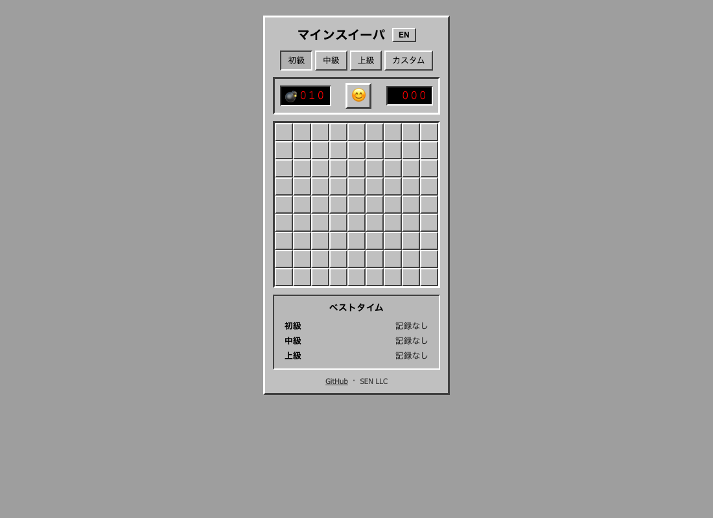

# Minesweeper

[](https://sen.ltd/portfolio/minesweeper/)

クラシックマインスイーパ。4 段階の難易度、キーボード操作、初手安全保証。

**Live demo**: https://sen.ltd/portfolio/minesweeper/



## 特徴

- 4 difficulty levels (Beginner, Intermediate, Expert, Custom)
- First-click safety guarantee
- Keyboard support (arrows, Space, F)
- Timer and best times (localStorage)
- Flood fill on empty cells
- Japanese / English UI
- Zero dependencies, no build

## ローカル起動

```sh
npm run serve
```

## テスト

```sh
npm test
```

## ライセンス

MIT. See [LICENSE](./LICENSE).

<!-- sen-publish:links -->
## Links

- 🌐 Demo: https://sen.ltd/portfolio/minesweeper/
- 📝 dev.to: https://dev.to/sendotltd/building-minesweeper-with-a-pure-function-game-engine-and-bfs-flood-fill-33f7
<!-- /sen-publish:links -->
